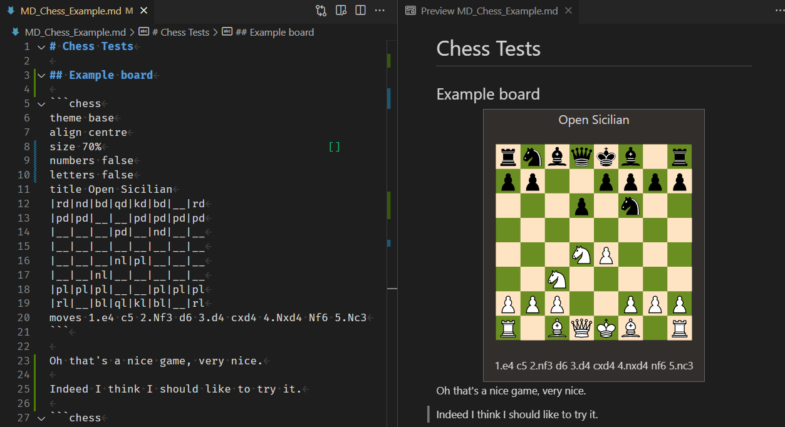

# markdown-chess README

Markdown-chess is a VSCode extension for markdown files for chess.

It extends markdown with the chess functionality you've always wanted!

## Features

### The Basic Board

Using **chess** code blocks you can describe a chess position in a very similar way to Wikipedia's {{Chess diagram}} format

## Requirements

If you have any requirements or dependencies, add a section describing those and how to install and configure them.

<!--## Extension Settings

Include if your extension adds any VS Code settings through the `contributes.configuration` extension point.

For example:

This extension contributes the following settings:

* `myExtension.enable`: enable/disable this extension
* `myExtension.thing`: set to `blah` to do something
-->
## Known Issues

## Release Notes

<!--### 1.0.0

Initial release of markdown-chess *TBD*...
-->

<!-------------------------------------------------------------------------------------------------------------
## Following extension guidelines

Ensure that you've read through the extensions guidelines and follow the best practices for creating your extension.

* [Extension Guidelines](https://code.visualstudio.com/api/references/extension-guidelines)
-->
